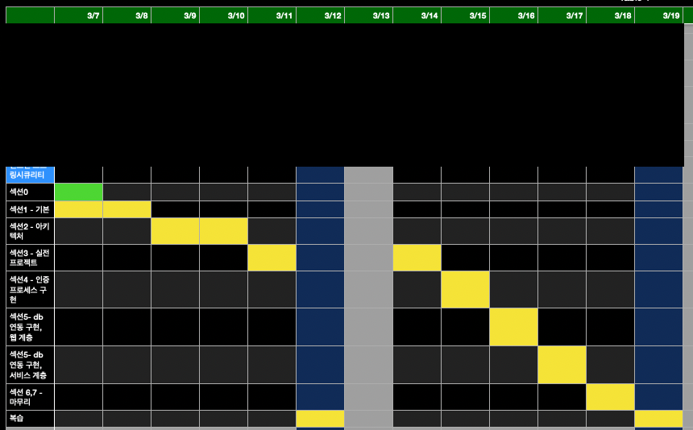

### 목적
spring security 잘 모르는 듯

나도 인증 flow 설계하고 싶다

나도 @preauthorize 사용하고 싶다.. 

### 기대 효과
- 복습
- 몰랐던 개념 습득
- security 인증 flow 설계할 줄 아는 능력 갖추기
- spring security 내부 코드도 살펴 보며 이해도 향상
- 프로젝트하며 이해도 향상
- 프로젝트 변형하며 이해도 향상

### 주의
사용법을 알게 되면 내부 동작 원리도 알아봐야 함

### 일정 계획

### 참고
https://github.com/onjsdnjs/corespringsecurity