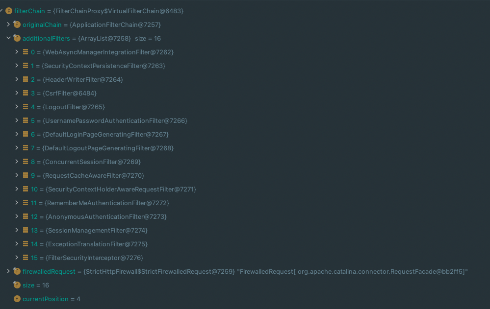

### WebSecurityConfigurerAdapter 

### form login custom

### UsernamePasswordAuthenticationFilter

### logout api, logout filter

### AnonymousAuthenticationFilter, token

### 인가 
설정할 때 더 좁은 범위의 antMatcher를 넓은 범위보다 먼저 써줘야 한다.

### 인증, 인가 예외 처리
  
 ExceptionTranslationFilter

### spring security filter chain
