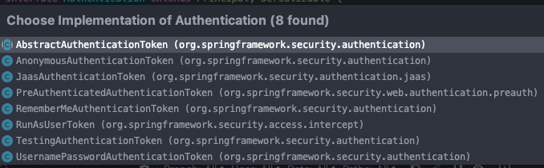

### 개요
- 인증이란 당신이 누구인지 증명하는 거라고 함
- spring security에서 Authentication은 유저의 인증 정보를 저장하는 토큰 개념으로 사용한다고 함..
- 인증 시, (id, passwd)를 전달한다고 함
- 인증 후, 인증 결과를 (user, 권한)을 담고 SecurityContext에 저장되어 전역적으로 참조가 가능하다고 함....
- 구성 요소
  - principal: user id 또는 User 객체라고 함
  - credentials: 비번
  - authorities: 인증된 유저의 권한 목록
  - details: 인증 부가 정보?
  - Authenticated: 인증 여부?


### 코드
- Authentication 인터페이스
  

```java
protected InterceptorStatusToken beforeInvocation(Object object) {
    Assert.notNull(object, "Object was null");
    if (!getSecureObjectClass().isAssignableFrom(object.getClass())) {
        throw new IllegalArgumentException("Security invocation attempted for object " + object.getClass().getName()
                + " but AbstractSecurityInterceptor only configured to support secure objects of type: "
                + getSecureObjectClass());
    }
    Collection<ConfigAttribute> attributes = this.obtainSecurityMetadataSource().getAttributes(object);
    if (CollectionUtils.isEmpty(attributes)) {
        Assert.isTrue(!this.rejectPublicInvocations,
                () -> "Secure object invocation " + object
                        + " was denied as public invocations are not allowed via this interceptor. "
                        + "This indicates a configuration error because the "
                        + "rejectPublicInvocations property is set to 'true'");
        if (this.logger.isDebugEnabled()) {
            this.logger.debug(LogMessage.format("Authorized public object %s", object));
        }
        publishEvent(new PublicInvocationEvent(object));
        return null; // no further work post-invocation
    }
    if (SecurityContextHolder.getContext().getAuthentication() == null) {
        credentialsNotFound(this.messages.getMessage("AbstractSecurityInterceptor.authenticationNotFound",
                "An Authentication object was not found in the SecurityContext"), object, attributes);
    }
    
    Authentication authenticated = authenticateIfRequired();
    if (this.logger.isTraceEnabled()) {
        this.logger.trace(LogMessage.format("Authorizing %s with attributes %s", object, attributes));
    }
    // Attempt authorization
    attemptAuthorization(object, attributes, authenticated);
    if (this.logger.isDebugEnabled()) {
        this.logger.debug(LogMessage.format("Authorized %s with attributes %s", object, attributes));
    }
    if (this.publishAuthorizationSuccess) {
        publishEvent(new AuthorizedEvent(object, attributes, authenticated));
    }

    // Attempt to run as a different user
    Authentication runAs = this.runAsManager.buildRunAs(authenticated, object, attributes);
    if (runAs != null) {
        SecurityContext origCtx = SecurityContextHolder.getContext();
        SecurityContext newCtx = SecurityContextHolder.createEmptyContext();
        newCtx.setAuthentication(runAs);
        SecurityContextHolder.setContext(newCtx);

        if (this.logger.isDebugEnabled()) {
            this.logger.debug(LogMessage.format("Switched to RunAs authentication %s", runAs));
        }
        // need to revert to token.Authenticated post-invocation
        return new InterceptorStatusToken(origCtx, true, attributes, object);
    }
    this.logger.trace("Did not switch RunAs authentication since RunAsManager returned null");
    // no further work post-invocation
    return new InterceptorStatusToken(SecurityContextHolder.getContext(), false, attributes, object);
}
```


```java
// 인증이 필요한지 검사, SecurityContext에 저장
private Authentication authenticateIfRequired() {
    Authentication authentication = SecurityContextHolder.getContext().getAuthentication();
    if (authentication.isAuthenticated() && !this.alwaysReauthenticate) {
        if (this.logger.isTraceEnabled()) {
            this.logger.trace(LogMessage.format("Did not re-authenticate %s before authorizing", authentication));
        }
        return authentication;
    }
    authentication = this.authenticationManager.authenticate(authentication);
    // Don't authenticated.setAuthentication(true) because each provider does that
    if (this.logger.isDebugEnabled()) {
        this.logger.debug(LogMessage.format("Re-authenticated %s before authorizing", authentication));
    }
    SecurityContext context = SecurityContextHolder.createEmptyContext();
    context.setAuthentication(authentication);
    SecurityContextHolder.setContext(context);
    return authentication;
}
```
