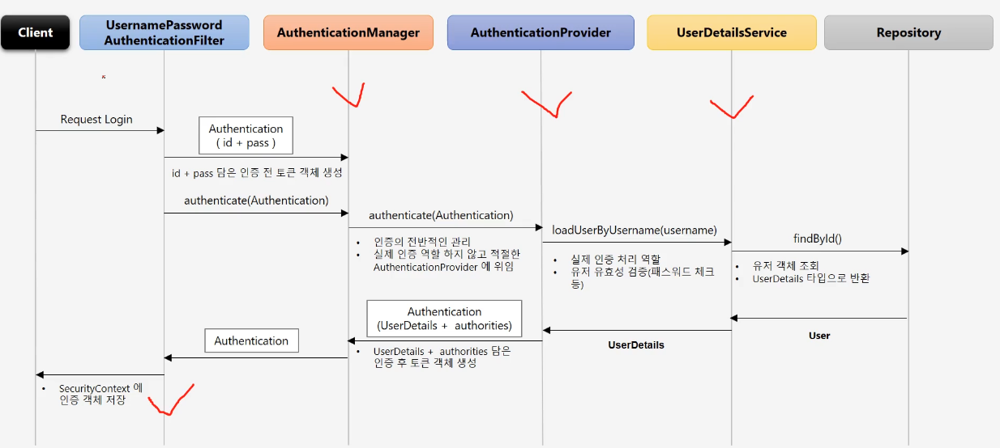

### 개요
- 스프링 시큐리티의 전반적인 인증 처리 과정(어떤 클래스들 이용하는지) 파악하기
- 스프링 시큐리티의 인증 처리 구현 참고해서 응용할 수 있도록 하기



- form login시 처리 과정
  - usernamePasswordAuthenticationFilter에서 authenticationManager.authenticate()
  - manager는 provider에게 authentication 정보 주면서 인증 위임함
  - provider는 UserDatails 가져와서 딱히 하는건 없고 인증정보를 적절히 조립해서 반환하는듯
  - 인증 성공하면 SecurityContextHolder에 인증 결과가 담긴 securityContext 저장함. rememberMe에도 저장하는듯

```java
@Override
// UsernamePasswordAuthenticationFilter에서
public Authentication attemptAuthentication(HttpServletRequest request, HttpServletResponse response)
        throws AuthenticationException {
    if (this.postOnly && !request.getMethod().equals("POST")) {
        throw new AuthenticationServiceException("Authentication method not supported: " + request.getMethod());
    }
    String username = obtainUsername(request);
    username = (username != null) ? username : "";
    username = username.trim();
    String password = obtainPassword(request);
    password = (password != null) ? password : "";
    UsernamePasswordAuthenticationToken authRequest = new UsernamePasswordAuthenticationToken(username, password);
    // Allow subclasses to set the "details" property
    setDetails(request, authRequest);
    return this.getAuthenticationManager().authenticate(authRequest);
}
```

```java
// authenticationManager 구현체 중 하나인 ProviderManager에서 provider를 이용해서 인증 처리하도록 함.
@Override
public Authentication authenticate(Authentication authentication) throws AuthenticationException {
    Class<? extends Authentication> toTest = authentication.getClass();
    AuthenticationException lastException = null;
    AuthenticationException parentException = null;
    Authentication result = null;
    Authentication parentResult = null;
    int currentPosition = 0;
    int size = this.providers.size();
    for (AuthenticationProvider provider : getProviders()) {
        if (!provider.supports(toTest)) {
            continue;
        }
        if (logger.isTraceEnabled()) {
            logger.trace(LogMessage.format("Authenticating request with %s (%d/%d)",
                    provider.getClass().getSimpleName(), ++currentPosition, size));
        }
        try {
            result = provider.authenticate(authentication);
            if (result != null) {
                copyDetails(authentication, result);
                break;
            }
        }
        catch (AccountStatusException | InternalAuthenticationServiceException ex) {
            prepareException(ex, authentication);
            // SEC-546: Avoid polling additional providers if auth failure is due to
            // invalid account status
            throw ex;
        }
        catch (AuthenticationException ex) {
            lastException = ex;
        }
    }
    if (result == null && this.parent != null) {
        // Allow the parent to try.
        try {
            parentResult = this.parent.authenticate(authentication);
            result = parentResult;
        }
        catch (ProviderNotFoundException ex) {
            // ignore as we will throw below if no other exception occurred prior to
            // calling parent and the parent
            // may throw ProviderNotFound even though a provider in the child already
            // handled the request
        }
        catch (AuthenticationException ex) {
            parentException = ex;
            lastException = ex;
        }
    }
    if (result != null) {
        if (this.eraseCredentialsAfterAuthentication && (result instanceof CredentialsContainer)) {
            // Authentication is complete. Remove credentials and other secret data
            // from authentication
            ((CredentialsContainer) result).eraseCredentials();
        }
        // If the parent AuthenticationManager was attempted and successful then it
        // will publish an AuthenticationSuccessEvent
        // This check prevents a duplicate AuthenticationSuccessEvent if the parent
        // AuthenticationManager already published it
        if (parentResult == null) {
            this.eventPublisher.publishAuthenticationSuccess(result);
        }

        return result;
    }

    // Parent was null, or didn't authenticate (or throw an exception).
    if (lastException == null) {
        lastException = new ProviderNotFoundException(this.messages.getMessage("ProviderManager.providerNotFound",
                new Object[] { toTest.getName() }, "No AuthenticationProvider found for {0}"));
    }
    // If the parent AuthenticationManager was attempted and failed then it will
    // publish an AbstractAuthenticationFailureEvent
    // This check prevents a duplicate AbstractAuthenticationFailureEvent if the
    // parent AuthenticationManager already published it
    if (parentException == null) {
        prepareException(lastException, authentication);
    }
    throw lastException;
}
```