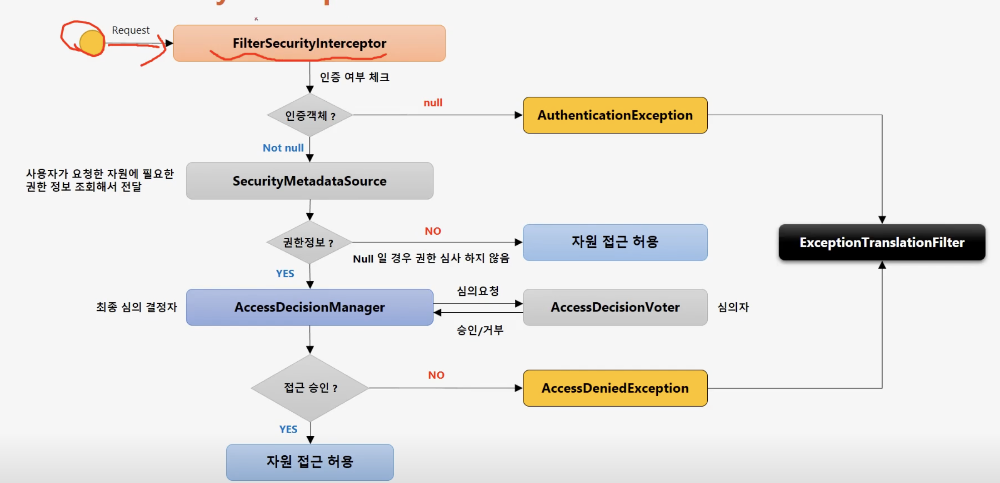
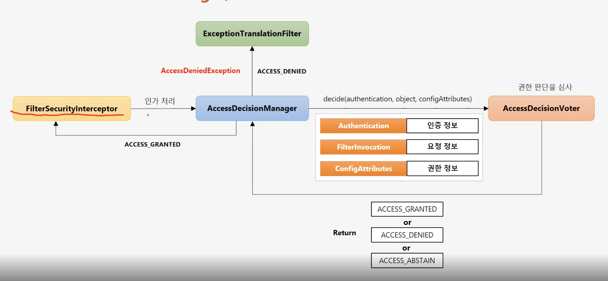

- Authorization(인증): 당신에게 무엇이 허가되었는지. 즉, Role 따지는 것
- 스프링 시큐리티가 지원하는 인가처리 계층
  - url 요청 단위 보안 (화면, 웹 계층)
  - 메서드(기능) 단위 보안 (서비스 계층)
  - 객체 단위 보안? (도메인 계층)

- FilterSecurityInterceptor
  
  - FilterSecurityInterceptor는 최종 인가 처리 담당하는 시큐리티 필터 체인의 마지막에 위치한 필터
  - 인증 객체가 없으면 AuthenticationException 발생
  - 인증 객체는 있는데 권한이 없으면 AccessDeniedException 발생
  - 권한 처리를 AccessDecisionManager에게 맡긴다고 함..
- access decision
  

```java
protected InterceptorStatusToken beforeInvocation(Object object) {
  Assert.notNull(object, "Object was null");
  if (!getSecureObjectClass().isAssignableFrom(object.getClass())) {
    throw new IllegalArgumentException("Security invocation attempted for object " + object.getClass().getName()
    + " but AbstractSecurityInterceptor only configured to support secure objects of type: "
    + getSecureObjectClass());
  }
  Collection<ConfigAttribute> attributes = this.obtainSecurityMetadataSource().getAttributes(object);
  if (CollectionUtils.isEmpty(attributes)) {
    Assert.isTrue(!this.rejectPublicInvocations,
    () -> "Secure object invocation " + object
    + " was denied as public invocations are not allowed via this interceptor. "
    + "This indicates a configuration error because the "
    + "rejectPublicInvocations property is set to 'true'");
    if (this.logger.isDebugEnabled()) {
      this.logger.debug(LogMessage.format("Authorized public object %s", object));
    }
    publishEvent(new PublicInvocationEvent(object));
    return null; // no further work post-invocation
  }
  if (SecurityContextHolder.getContext().getAuthentication() == null) {
    credentialsNotFound(this.messages.getMessage("AbstractSecurityInterceptor.authenticationNotFound",
    "An Authentication object was not found in the SecurityContext"), object, attributes);
  }
  Authentication authenticated = authenticateIfRequired();
  if (this.logger.isTraceEnabled()) {
    this.logger.trace(LogMessage.format("Authorizing %s with attributes %s", object, attributes));
  }
  // Attempt authorization
  attemptAuthorization(object, attributes, authenticated);
  if (this.logger.isDebugEnabled()) {
    this.logger.debug(LogMessage.format("Authorized %s with attributes %s", object, attributes));
  }
  if (this.publishAuthorizationSuccess) {
    publishEvent(new AuthorizedEvent(object, attributes, authenticated));
  }
  
  // Attempt to run as a different user
  Authentication runAs = this.runAsManager.buildRunAs(authenticated, object, attributes);
  if (runAs != null) {
    SecurityContext origCtx = SecurityContextHolder.getContext();
    SecurityContext newCtx = SecurityContextHolder.createEmptyContext();
    newCtx.setAuthentication(runAs);
    SecurityContextHolder.setContext(newCtx);
    
    if (this.logger.isDebugEnabled()) {
        this.logger.debug(LogMessage.format("Switched to RunAs authentication %s", runAs));
    }
    // need to revert to token.Authenticated post-invocation
    return new InterceptorStatusToken(origCtx, true, attributes, object);
  }
  this.logger.trace("Did not switch RunAs authentication since RunAsManager returned null");
  // no further work post-invocation
  return new InterceptorStatusToken(SecurityContextHolder.getContext(), false, attributes, object);

}
```

```java
protected Object afterInvocation(InterceptorStatusToken token, Object returnedObject) {
      if (token == null) {
        // public object
        return returnedObject;
      }
      finallyInvocation(token); // continue to clean in this method for passivity
        
      if (this.afterInvocationManager != null) {
        // Attempt after invocation handling
        try {
          returnedObject = this.afterInvocationManager.decide(token.getSecurityContext().getAuthentication(),
          token.getSecureObject(), token.getAttributes(), returnedObject);
        }
        catch (AccessDeniedException ex) {
          publishEvent(new AuthorizationFailureEvent(token.getSecureObject(), token.getAttributes(),
          token.getSecurityContext().getAuthentication(), ex));
          throw ex;
        }
      }
    return returnedObject;
}
```


