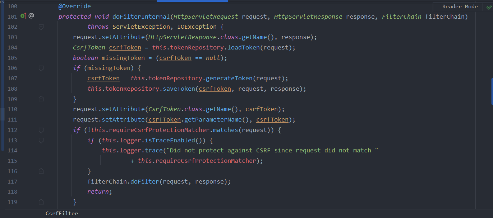

- spring security는 csrf 취약점에 대응하기 위한 API를 제공한다

- CsrfFilter, csrf token을 이용해 csrf 취약점 대응

- CsrfFilter 주요 로직

  

- thymeleaf는 POST 요청할 때 csrf 토큰을 생성해준다고함
- spring의 form 태그(spring의 form 태그가 뭔 말?)도 csrf 토큰을 생성해준다고 함. 

- get 이외의 요청시에만 csrf 토큰 검사하는 듯?
