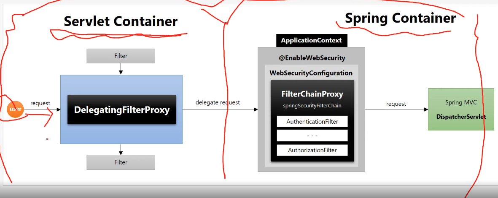

### 개요
- 위임하는 필터 및 필터 bean 초기화 정리 

  DelgatingProxyChain, FilterChainProxy가 사용됨

  

- spring security는 서블렛 필터 기반으로 인증, 인가 처리
    
  근데 서블렛 필터는 spring에서 정의한 bean을 주입해서 사용할 수 없는 문제가 있음

  `DelegatingFilterProxy`가 서블렛 필터와 spring bean 사이를 이어주는 역할을 함 (요청을 위임?)

  `FilterChainProxy`가 필터 체인의 필터들을 proxy하게 호출

  `즉, DelegatingFilterProxy -> FilterChainProxy를 거쳐서 인증/인가 처리함.`

### 위임자, 필터 체인을 초기화하는 부분
```java
// DelegatingFilterProxy 생성자
public DelegatingFilterProxy(String targetBeanName, @Nullable WebApplicationContext wac) {
    Assert.hasText(targetBeanName, "Target Filter bean name must not be null or empty");
    this.setTargetBeanName(targetBeanName); // target bean name 디버그해보면 springSecurityFilterChain이라고 나옴 
    this.webApplicationContext = wac;
    if (wac != null) {
        this.setEnvironment(wac.getEnvironment());
    }
}
```

```java
// WebSecurity.performBuild()에서 filterChainProxy를 생성하는 부분
@Override
protected Filter performBuild() throws Exception {
    Assert.state(!this.securityFilterChainBuilders.isEmpty(),
            () -> "At least one SecurityBuilder<? extends SecurityFilterChain> needs to be specified. "
                    + "Typically this is done by exposing a SecurityFilterChain bean "
                    + "or by adding a @Configuration that extends WebSecurityConfigurerAdapter. "
                    + "More advanced users can invoke " + WebSecurity.class.getSimpleName()
                    + ".addSecurityFilterChainBuilder directly");
    int chainSize = this.ignoredRequests.size() + this.securityFilterChainBuilders.size();
    List<SecurityFilterChain> securityFilterChains = new ArrayList<>(chainSize);
    List<RequestMatcherEntry<List<WebInvocationPrivilegeEvaluator>>> requestMatcherPrivilegeEvaluatorsEntries = new ArrayList<>();
    for (RequestMatcher ignoredRequest : this.ignoredRequests) {
        WebSecurity.this.logger.warn("You are asking Spring Security to ignore " + ignoredRequest
                + ". This is not recommended -- please use permitAll via HttpSecurity#authorizeHttpRequests instead.");
        SecurityFilterChain securityFilterChain = new DefaultSecurityFilterChain(ignoredRequest);
        securityFilterChains.add(securityFilterChain);
        requestMatcherPrivilegeEvaluatorsEntries
                .add(getRequestMatcherPrivilegeEvaluatorsEntry(securityFilterChain));
    }
    for (SecurityBuilder<? extends SecurityFilterChain> securityFilterChainBuilder : this.securityFilterChainBuilders) {
        SecurityFilterChain securityFilterChain = securityFilterChainBuilder.build();
        securityFilterChains.add(securityFilterChain);
        requestMatcherPrivilegeEvaluatorsEntries
                .add(getRequestMatcherPrivilegeEvaluatorsEntry(securityFilterChain));
    }
    if (this.privilegeEvaluator == null) {
        this.privilegeEvaluator = new RequestMatcherDelegatingWebInvocationPrivilegeEvaluator(
                requestMatcherPrivilegeEvaluatorsEntries);
    }
    FilterChainProxy filterChainProxy = new FilterChainProxy(securityFilterChains);
    if (this.httpFirewall != null) {
        filterChainProxy.setFirewall(this.httpFirewall);
    }
    if (this.requestRejectedHandler != null) {
        filterChainProxy.setRequestRejectedHandler(this.requestRejectedHandler);
    }
    filterChainProxy.afterPropertiesSet();

    Filter result = filterChainProxy;
    if (this.debugEnabled) {
        this.logger.warn("\n\n" + "********************************************************************\n"
                + "**********        Security debugging is enabled.       *************\n"
                + "**********    This may include sensitive information.  *************\n"
                + "**********      Do not use in a production system!     *************\n"
                + "********************************************************************\n\n");
        result = new DebugFilter(filterChainProxy);
    }
    this.postBuildAction.run();
    return result;
}
```

### 위임자, 필터 체인이 동작하는 부분
```java
// Delegating하는 부분
@Override
public void doFilter(ServletRequest request, ServletResponse response, FilterChain filterChain)
        throws ServletException, IOException {

    // Lazily initialize the delegate if necessary.
    Filter delegateToUse = this.delegate;
    if (delegateToUse == null) {
        synchronized (this.delegateMonitor) {
            delegateToUse = this.delegate;
            if (delegateToUse == null) {
                WebApplicationContext wac = findWebApplicationContext();
                if (wac == null) {
                    throw new IllegalStateException("No WebApplicationContext found: " +
                            "no ContextLoaderListener or DispatcherServlet registered?");
                }
                delegateToUse = initDelegate(wac);
            }
            this.delegate = delegateToUse;
        }
    }

    // Let the delegate perform the actual doFilter operation.
    invokeDelegate(delegateToUse, request, response, filterChain);
}
```

```java
// 각각의 필터 체인을 사용하는 부분
@Override
public void doFilter(ServletRequest request, ServletResponse response) throws IOException, ServletException {
    if (this.currentPosition == this.size) {
        if (logger.isDebugEnabled()) {
            logger.debug(LogMessage.of(() -> "Secured " + requestLine(this.firewalledRequest)));
        }
        // Deactivate path stripping as we exit the security filter chain
        this.firewalledRequest.reset();
        this.originalChain.doFilter(request, response);
        return;
    }
    this.currentPosition++;
    Filter nextFilter = this.additionalFilters.get(this.currentPosition - 1);
    if (logger.isTraceEnabled()) {
        logger.trace(LogMessage.format("Invoking %s (%d/%d)", nextFilter.getClass().getSimpleName(),
                this.currentPosition, this.size));
    }
    nextFilter.doFilter(request, response, this);
}

}
```

