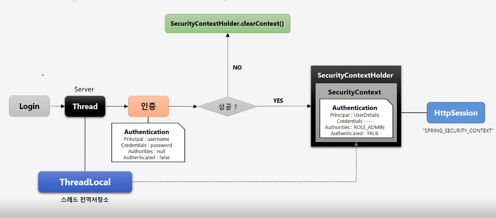

### SecurityContext
- Authentication 객체가 저장되는 보관소. 꺼내 쓸 수 있도록
- ThreadLocal에 저장되어서 아무 곳에서나 참조가 가능하다고 하도록 설계되었다고 함

  


- 스레드로컬 저장 방식(strategy) 몇개 있음.


```java
// SecurityContextHolder.getContext().getAuthentication()로 인증정보 꺼내와서 인증처리하고, 또 저장함 
private Authentication authenticateIfRequired() {
    Authentication authentication = SecurityContextHolder.getContext().getAuthentication();
    if (authentication.isAuthenticated() && !this.alwaysReauthenticate) {
        if (this.logger.isTraceEnabled()) {
            this.logger.trace(LogMessage.format("Did not re-authenticate %s before authorizing", authentication));
        }
        return authentication;
    }
    authentication = this.authenticationManager.authenticate(authentication);
    // Don't authenticated.setAuthentication(true) because each provider does that
    if (this.logger.isDebugEnabled()) {
        this.logger.debug(LogMessage.format("Re-authenticated %s before authorizing", authentication));
    }
    SecurityContext context = SecurityContextHolder.createEmptyContext();
    context.setAuthentication(authentication);
    SecurityContextHolder.setContext(context);
    return authentication;
}
```