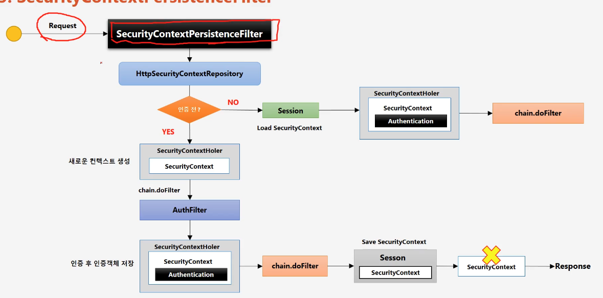

### 관련 개념
- AnonymousAuthenticationFilter, AnonymousAuthenticationToken
- UsernamePasswordAuthenticationFilter, UsernamePasswordAuthenticationToken 
- SecurityContext

  

- 동작 방식을 요약하면, 첫 요청 때 securityContext 만들고, 이후 요청에는 session에서 이미 만든 인증정보 가져와서 사용한다는거 같음

```java
// SecurityContextPersistenceFilter 처리 로직
// 세션 만듦
// SecurityContextRepository에서 securityContext 가져옴
// SecurityContextRepository는 http의 경우 세션으로부터 securityContext 가져오는거임
// 그리고 SecurityContextHolder에 가져온 securityContext 담음
// 그리고나서 다음 필터로 넘기고, 다음 필터에서 SecurityContextHolder에서 인증 정보 가져와 인증처리하는듯

private void doFilter(HttpServletRequest request, HttpServletResponse response, FilterChain chain)
			throws IOException, ServletException {
    // ensure that filter is only applied once per request
    if (request.getAttribute(FILTER_APPLIED) != null) {
        chain.doFilter(request, response);
        return;
    }
    request.setAttribute(FILTER_APPLIED, Boolean.TRUE);
    if (this.forceEagerSessionCreation) {
        HttpSession session = request.getSession();
        if (this.logger.isDebugEnabled() && session.isNew()) {
            this.logger.debug(LogMessage.format("Created session %s eagerly", session.getId()));
        }
    }
    HttpRequestResponseHolder holder = new HttpRequestResponseHolder(request, response);
    SecurityContext contextBeforeChainExecution = this.repo.loadContext(holder);
    try {
        SecurityContextHolder.setContext(contextBeforeChainExecution);
        if (contextBeforeChainExecution.getAuthentication() == null) {
            logger.debug("Set SecurityContextHolder to empty SecurityContext");
        }
        else {
            if (this.logger.isDebugEnabled()) {
                this.logger
                        .debug(LogMessage.format("Set SecurityContextHolder to %s", contextBeforeChainExecution));
            }
        }
        chain.doFilter(holder.getRequest(), holder.getResponse());
    }
    finally {
        SecurityContext contextAfterChainExecution = SecurityContextHolder.getContext();
        // Crucial removal of SecurityContextHolder contents before anything else.
        SecurityContextHolder.clearContext();
        this.repo.saveContext(contextAfterChainExecution, holder.getRequest(), holder.getResponse());
        request.removeAttribute(FILTER_APPLIED);
        this.logger.debug("Cleared SecurityContextHolder to complete request");
    }
}
```